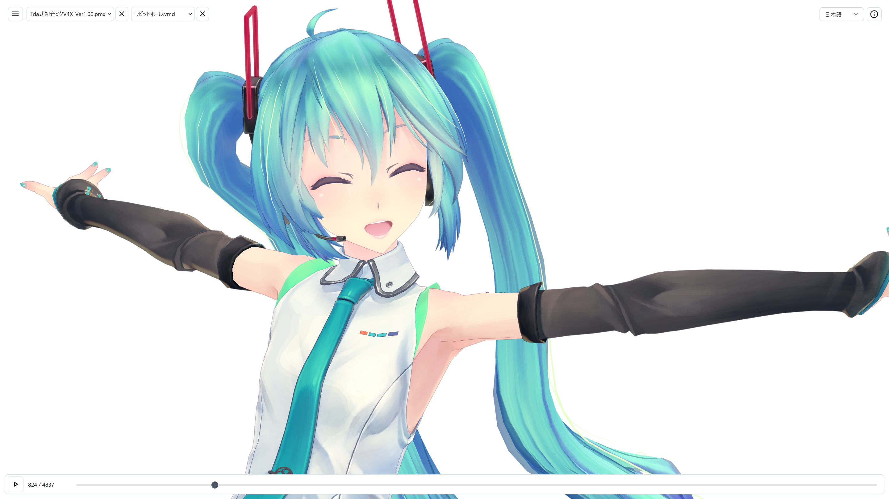

# @yohawing/three-mmd-loader

A library for loading and playing back MMD models and motions on Three.js.

[日本語](./docs/README.ja.md) / [Live demo](https://three.mmd.yohawing.com/)



Screenshot assets: model [Tda式初音ミク V4X by Tda](https://3d.nicovideo.jp/works/td30681),
motion [ラビットホール by mobiusP](https://www.nicovideo.jp/watch/sm42576784).

## Compatibility Matrix

### Formats

| Format | Parse | Runtime apply |
| --- | --- | --- |
| PMX (model) | ✅ | ✅ |
| PMD (model) | ✅ | ✅ |
| VMD (motion) | ✅ | ✅ |
| VPD (pose) | ✅ | ✅ |
| PMM (project) | ❌ | ❌ |
| .x / .vac (accessory) | ❌ | ❌ |
| .emm / .emd (effect project) | ❌ | ❌ |
| .fx (MME effect) | ❌ | ❌ |

### Features

| Feature | Status |
| --- | --- |
| Parser | ✅ PMX / PMD / VMD / VPD TypeScript parser |
| Deform / skinning | ✅ BDEF1/2/4, SDEF, QDEF |
| MMD material / toon shader | ✅ Toon textures, alpha blending decisions, and material render ordering |
| Append transform | ✅ PMX layer order |
| IK link angle limits | ✅ PMX / PMD link limits with parent-local Euler clamp |
| VMD Camera / Light | ✅ Applies to Three.js Camera and DirectionalLight |
| Self Shadow | ✅ Three.js shadow-map path with VMD self-shadow sampling |
| Physics | ✅ MMD-optimized prebuilt Bullet Physics; Ammo.js backend is deprecated compatibility path |
| Soft Body | ⚠️ PMX data parsed; runtime simulation not implemented |

The default PMX runtime and WASM parser are backed by
[yohawing/mmd-anim](https://github.com/yohawing/mmd-anim).

## Acknowledgements

This project was developed with reference to:

- [Babylon-MMD](https://github.com/noname0310/babylon-mmd)
- [saba](https://github.com/benikabocha/saba)
- [nanoem](https://github.com/hkrn/nanoem)

---

## Install

```powershell
npm install @yohawing/three-mmd-loader three
```

## Usage - Model Loading

```ts
import { ThreeMmdLoader } from "@yohawing/three-mmd-loader";

const loader = new ThreeMmdLoader();
const model = await loader.loadModel(source); // Uint8Array | ArrayBuffer | File | string (URL/path resolved via fetch)
scene.add(model.root);
```

## Usage - Animation

```ts
import * as THREE from "three";
import { applyMmdCameraStateToThreeCamera } from "@yohawing/three-mmd-loader";

const model = await loader.loadModel(modelSource);
const { animation } = await loader.loadAnimation(vmdSource);
model.setAnimation(animation);

const perspectiveCamera = new THREE.PerspectiveCamera();

// Per frame.
model.update(currentSeconds);
const cameraState = model.runtime.cameraState();
if (cameraState) {
  const activeCamera = applyMmdCameraStateToThreeCamera(perspectiveCamera, cameraState, {
    aspect: renderer.domElement.clientWidth / renderer.domElement.clientHeight
  });
  renderer.render(scene, activeCamera);
}
```

`applyMmdCameraStateToThreeCamera(...)` converts MMD camera coordinates for
Three.js and returns the active camera.

## Usage - Pose (VPD)

```ts
const { pose } = await loader.loadPose(vpdSource);
const { animation } = await loader.loadPoseAnimation(vpdSource, "myPose");
model.setAnimation(animation);
```

## Usage - Physics

Physics is abstracted behind `MmdPhysicsBackend` so the physics library can be
swapped. We recommend the MMD-optimized prebuilt Bullet Physics path. The
Ammo.js backend remains available as a compatibility path, but it is deprecated
and planned for removal from the default guidance.

```ts
import {
  createCustomBulletMmdPhysicsBackend,
  loadCustomBulletMmdModule
} from "@yohawing/three-mmd-loader/physics";

// Recommended: MMD-optimized prebuilt Bullet Physics.
const mmdBullet = await loadCustomBulletMmdModule();
const directPhysicsBackend = createCustomBulletMmdPhysicsBackend(mmdBullet);
```

## Development

Development notes for tests, scripts, and fixtures are in
[docs/DEVELOPMENT.md](./docs/DEVELOPMENT.md), including mmd-anim / Yw MMD and
MMD-optimized Bullet Physics build notes. The release checklist is in
[docs/RELEASE.md](./docs/RELEASE.md).
